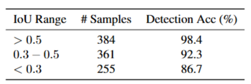
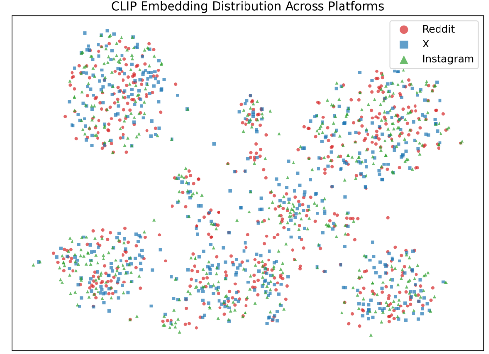
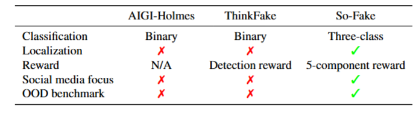
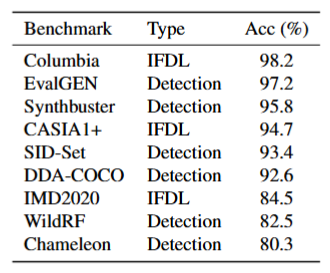
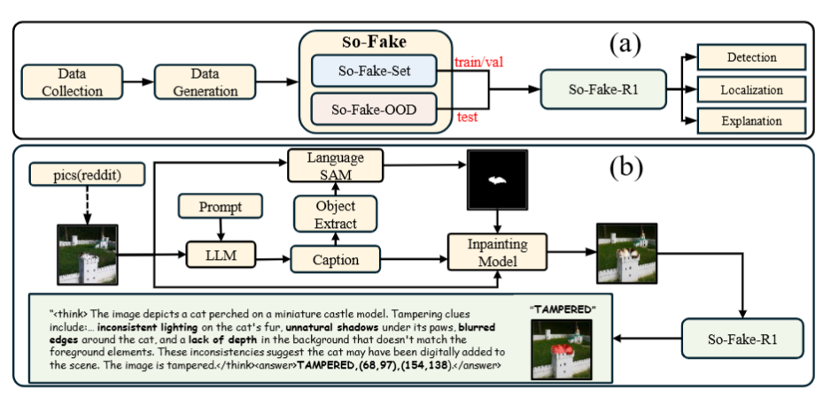

# Summary of Revisions and Additional Experiments

We sincerely thank all reviewers for their constructive feedback. During the rebuttal period, we conducted extensive additional experiments and incorporated all suggested revisions into the manuscript. 

---

## 1. Captioning Pipeline Robustness (Reviewer pwQv W1, Reviewer ZqnC W3)

To verify that detectors trained on So-Fake-Set are not exploiting captioning artifacts, we used four captioning models (Qwen2.5-VL-7B, InternVL2-7B, BLIP-2, InstructBLIP) to generate prompts for the same set of 1,000 source images. For each captioning model, we synthesized 500 images using FLUX.1-dev and 500 using SD-3. We evaluated using two detectors with distinct architectures: So-Fake-R1 (VLM-based) and CNNSpot (CNN-based).

### Table 1: Captioning pipeline robustness. Detection accuracy (%) across different captioning models, generators, and detectors.

Detection accuracy varies by less than 1% across all captioning models for both detectors, confirming that the learned forensic signals stem from generator-specific visual artifacts rather than captioning pipeline fingerprints.

---

## 2. Detection-Localization Correlation Analysis (Reviewer pwQv W2)

To address whether So-Fake-R1's detection relies on perception of manipulated regions, we conducted a correlation analysis on 1,000 tampered images, grouped by localization quality:

### Table 2: Correlation between localization quality and detection accuracy on tampered images.

Detection accuracy is significantly higher when localization is accurate (98.4% vs. 86.7%), confirming that the model's classification decisions are informed by its perception of manipulated regions rather than relying solely on global distributional cues.

---

## 3. Cross-Platform Validation (Reviewer Mj1v W2, Reviewer tF8E Q1/Q2)

### 3.1 Content Distribution Analysis

We manually collected images from X and Instagram (500 real + 500 AI-generated per platform). Using our 12-class taxonomy, the top-5 content categories (human, animal, landscape, food, event) account for over 80% of content on all three platforms, confirming substantial overlap.

### 3.2 CLIP Embedding Visualization

We extracted CLIP (ViT-L/14) embeddings from images across three platforms and visualized their distributions using t-SNE:

### Figure 1: CLIP embedding distribution across Reddit, X, and Instagram.

Image embeddings from all three platforms exhibit substantial overlap in the semantic space, with no clear platform-specific clustering. This confirms that Reddit content covers a similar semantic distribution to X and Instagram.

### 3.3 Detection Performance Across Platforms

We evaluated multiple detectors trained on So-Fake-Set on each platform:

### Table 3: Cross-platform detection performance. Detectors trained on So-Fake-Set evaluated across different social media platforms.

The consistent detection performance across platforms supports Reddit as a reasonable proxy for social media evaluation.

### 3.4 Regulatory Justification

Among major social media platforms, Reddit explicitly supports non-commercial academic research through its [Public Content Policy](https://support.reddithelp.com/hc/en-us/articles/26410290525844-Public-Content-Policy) and dedicated researcher programs. Our data was collected through Reddit's official API with approved academic access. We believe that respecting platform data policies is essential for the academic community, and an open, transparent, and reproducible benchmark is the foundation for enabling future research to advance this field collectively.

---

## 4. Multi-Resolution Analysis (Reviewer Mj1v Q1)

We trained a separate model at 384×384 resolution and performed cross-resolution evaluation on So-Fake-OOD (evaluated on a 15K subset, 5,000 per class):

### Table 4: Multi-resolution analysis. Cross-resolution evaluation on So-Fake-OOD.

The results reveal that the critical factor is train-eval resolution consistency rather than absolute resolution. When training and evaluation resolutions are matched, performance is comparable (224→224: 76.8% vs. 384→384: 76.9%), whereas mismatched resolutions consistently lead to a 3-4% drop. This indicates that our VLM-based framework captures semantic-level forensic cues that are resolution-agnostic, and 224×224 represents a principled choice that balances computational efficiency with detection performance.

---

## 5. Comparison with AIGI-Holmes and ThinkFake (Reviewer Mj1v W1)

### Table 5: Task-level comparison between So-Fake-R1, AIGI-Holmes, and ThinkFake.

Both AIGI-Holmes and ThinkFake are limited to binary classification with textual explanations, and neither supports localization. So-Fake-R1 addresses a more challenging three-class problem and jointly optimizes detection, localization, and explanation. Distinguishing tampered from fully synthetic images requires the model to perceive whether manipulation is local or global, which is a fundamentally different capability from binary real/fake classification.

---

## 6. Expanded Baseline Comparison on So-Fake-OOD (Reviewer ZqnC W4)

### Table 6: Expanded baseline comparison on So-Fake-OOD. Methods marked with † are newly added during the rebuttal period.

We have expanded our evaluation with five additional strong detection baselines: Community-Forensics (2025), AIDE (2025), EFFORT (2025), C2P-CLIP (2025), and DDA (2025). All baselines are evaluated under the same setting on So-Fake-OOD. So-Fake-R1 achieves the highest accuracy among all compared methods.

---

## 7. Cross-Dataset Training Comparison (Reviewer tF8E W3)

To quantitatively demonstrate So-Fake's advantage over existing datasets, we trained CNNSpot on three different datasets and evaluated on So-Fake-OOD:

### Table 7: Cross-dataset training comparison.

Models trained on So-Fake-Set achieve the highest cross-domain generalization, demonstrating the quantitative advantage of our dataset.

---

## 8. Expanded Cross-Dataset Evaluation (Reviewer Mj1v Q2, Reviewer tF8E W4, Reviewer Mj1v Follow-up)

So-Fake-R1 (trained on So-Fake-Set) evaluated across 9 diverse benchmarks:

### Table 8: Expanded cross-dataset evaluation.

So-Fake-R1 achieves consistently strong performance across all 9 benchmarks. While individual specialized detectors may outperform on specific benchmarks, So-Fake-R1 maintains competitive accuracy across all settings as a unified multi-task framework that additionally provides localization and explanation capabilities.

---

## 9. Presentation Improvements

### 9.1 Revised Figures (Reviewer tF8E W2)

We have increased the font size in Figures 1 and 2 to improve readability:

### Figure 2: Revised Figure 1 with improved font size.

### Figure 3: Revised Figure 2 with improved font size.

### 9.2 Localization Performance Framing (Reviewer pwQv W3)

We have revised the manuscript to note that while 48.6 IoU represents the best result among all evaluated methods on So-Fake-Set, precise localization of manipulated regions remains a challenging open problem with significant room for improvement.

---

## Summary

During the rebuttal period, we conducted **8 new experiments** and made **2 presentation improvements** addressing feedback from all reviewers. All revisions have been incorporated into the revised manuscript. We sincerely thank all reviewers for their constructive feedback, which has substantially strengthened our work.
